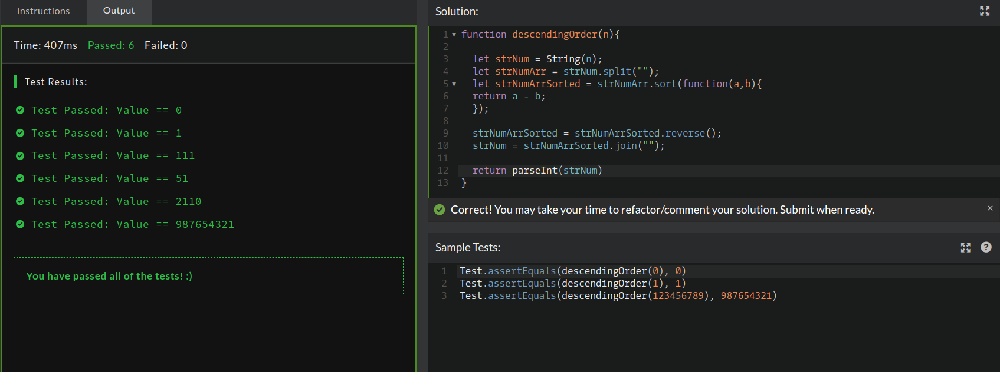

## CodeWars Challenge- 7

Your task is to make a function that can take any non-negative integer as a argument and return it with its digits in descending order. Essentially, rearrange the digits to create the highest possible number.

*Examples Given:*
1. Input: 21445 Output: 54421

2. Input: 145263 Output: 654321

3. Input: 1254859723 Output: 9875543221

## Used

1. JavaScript

## My solution:
The first step I took while trying to solve this kata was figure out what kind of value I was working with. I used typeof(n) in the console and passed in one of the examples given, the console returned that it was a number so I knew this challenge would involve converting this number into a string, I did this by using the String global object with n as the parameter (or thing to be converted), I then stored the string in a variable. I prefer using camelCase notation for my variables, to keep consistency.

I then had to split the string of numbers and since the split method splits them into an array of strings I created a new variable to hold this called strNumArr. At this point I needed to sort the array of strings so I created a variable called strNumArrSorted and set it equal to the value of strNumArr.sort(passing in a comparison function here to return the string of array in an ascending order).

Lastly I needed to reverse the string to get the expected output and join the split string, for this I use the reverse() & join("") methods. In the end I have the reverse string  of the input, but need numbers, not a string, so I can call the parseInt method on strNum to parse the string and return the integers.

## Refactoring

After solving this challenge I wanted to practice code golfing, as well as, implementing more ES6 notation. I was able to recreate my process but in less than four lines of code. You can find this solution below my original solution. 
